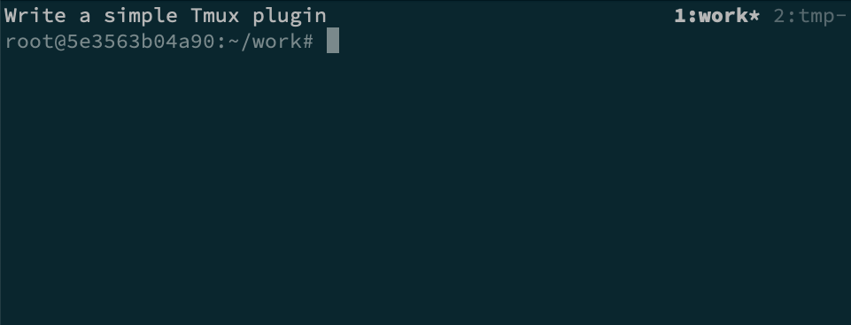

# Simple focus status bar for Tmux

Nothing flashy, in fact, the opposite - simple status bar with a focus text on the left, taken from a file (default is `$/.focus-status` but is configurable via `@focus-status-file`), and a window list on the right. Perhaps controversially, the status bar itself is at the top, to balance status bars from other programs such as Vim.

There are no colour definitions, I prefer to take the terminal theme as it is.

Setting a focus text and having it displayed like this helps keep my mind on track.

I wrote this plugin for two reasons:

- to modularise my Tmux configuration
- to learn how to write plugins

## Installation

Via [TPM](https://github.com/tmux-plugins/tpm):

```tmux
set -g @plugin 'qmacro/tmux-focus-status'
```

## Configuration

Nothing is required, but it's possible to configure a different file from which to take the focus status (the default is `~/.focus-status`):

```tmux
set -g @focus-status-file '/path/to/another/file'
```

> Only the first line from the file contents is used for the focus status text.

## Screenshot


